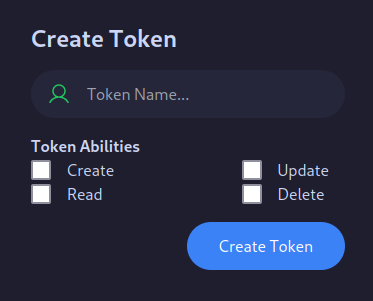
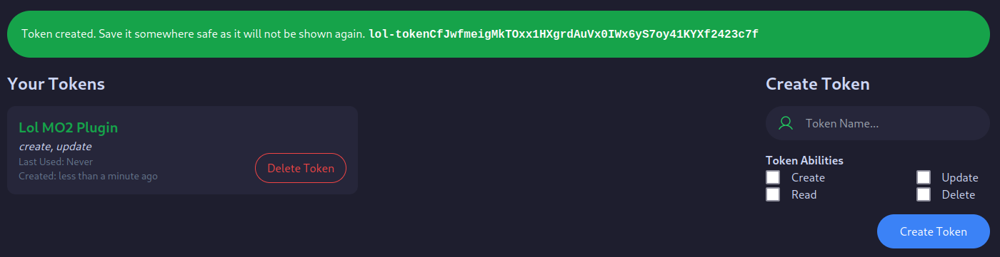

:::note
You only need an API Token if you want make use of your existing account. If you want to upload **Anonymously**, you can skip this section.
:::

## Getting an API Token

import { Steps } from '@astrojs/starlight/components';

<Steps>

1. Login and go `/profile/api`

	You can get there from the user dropdown, or the link on the profile page.

    

    Choose the token name and its abilities.

2. Save the token somewhere safe

    

    Once the token is created, make sure to save it somewhere safe as it will not be shown again.

</Steps>

## Using the Token

Using the token is really simple. Just send requests with a `Authorization: Bearer <token>` header.

Not all routes required a token to use, and it will be called out when they do.

import { Code, Tabs, TabItem } from '@astrojs/starlight/components';
export const jsExample = `async function getUser() {
    const resp = await fetch(\`\$\{baseUrl\}/user\`, {
        headers: {
            Accept: "application/json",
            Authorization: "Bearer <your-api-token>"
        },
    });
    console.log(await resp.json());
}`;

<Tabs>
  <TabItem label="JavaScript" icon="seti:javascript">
    <Code code={jsExample} lang="js" />
  </TabItem>
</Tabs>
